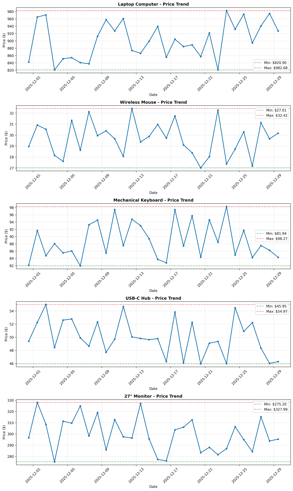

# 🛒 E-commerce Price Monitor

Automated web scraping tool to track and analyze product prices from e-commerce websites with comprehensive trend visualization and analytics.



## 🎯 Features

- **Automated Price Scraping**: Extract product prices from various e-commerce platforms
- **Multi-Product Tracking**: Monitor multiple products simultaneously
- **Historical Data Storage**: Store price history in CSV format for long-term analysis
- **Price Trend Analysis**: Identify price fluctuations and patterns over time
- **Interactive Visualizations**:
  - Static charts with Matplotlib
  - Interactive Plotly dashboards
  - Price comparison bar charts
- **Summary Statistics**: Min/Max/Average prices and percentage changes
- **Demo Mode**: Built-in sample data generator for testing

## 🛠️ Tech Stack

- **Python 3.8+**
- **BeautifulSoup4**: HTML parsing and web scraping
- **Requests**: HTTP requests for web scraping
- **Pandas**: Data manipulation and analysis
- **Matplotlib**: Static data visualizations
- **Plotly**: Interactive charts and dashboards
- **LXML**: Fast XML/HTML parser

## 📦 Installation
```bash
# Clone repository
git clone https://github.com/code-craftsman369/ecommerce-price-monitor.git
cd ecommerce-price-monitor

# Install dependencies
pip install -r requirements.txt
```

## 🚀 Usage

### Quick Start (Demo Mode)

Run the demo to generate sample data and visualizations:
```bash
# Generate demo price data
cd src
python3 scraper.py

# Analyze and visualize
python3 analyzer.py
```

This will create:
- `data/price_history.csv`: Historical price data
- `output/price_trends.png`: Price trend charts
- `output/price_trends_interactive.html`: Interactive visualization
- `output/price_comparison.html`: Current price comparison

### Custom Product Monitoring

1. **Configure Target URLs**

Edit `src/scraper.py` to add your target product URLs:
```python
# Example: Monitoring specific products
products = [
    {
        'url': 'https://example.com/product-page',
        'selector': '.price-class'  # CSS selector for price
    }
]
```

2. **Run Price Collection**
```bash
cd src
python3 scraper.py
```

3. **Analyze Results**
```bash
python3 analyzer.py
```

## 📊 Output Examples

### Summary Statistics
```
             Product  Current Price  Min Price  Max Price  Avg Price  Price Change  Change %  Records
      Laptop Computer        $899.99    $809.99    $989.99    $899.45       +$10.00    +1.12%       30
       Wireless Mouse         $29.99     $26.99     $32.99     $29.85        -$0.50    -1.64%       30
Mechanical Keyboard         $89.99     $80.99     $98.99     $89.50        +$2.00    +2.28%       30
```

### Visualizations

- **Line Charts**: Track price changes over time for each product
- **Interactive Plots**: Zoom, pan, and hover to explore data
- **Bar Charts**: Compare current prices across products

## 📁 Project Structure
```
ecommerce-price-monitor/
├── src/
│   ├── scraper.py          # Web scraping logic
│   ├── analyzer.py         # Data analysis and visualization
│   └── config.py           # Configuration settings
├── data/
│   └── price_history.csv   # Historical price data
├── output/                 # Generated visualizations
│   ├── price_trends.png
│   ├── price_trends_interactive.html
│   └── price_comparison.html
├── requirements.txt
├── .env.example
└── README.md
```

## 🔧 Configuration

### Environment Variables

Copy `.env.example` to `.env` and configure:
```env
# Target URLs to monitor (comma-separated)
TARGET_URLS=https://example.com/product1,https://example.com/product2

# Scraping interval (in hours)
SCRAPE_INTERVAL=24
```

### Custom CSS Selectors

Different e-commerce sites use different HTML structures. Update `config.py` with appropriate CSS selectors:
```python
COMMON_SELECTORS = [
    '.price',              # Generic
    '.a-price-whole',      # Amazon
    '.product-price',      # Common pattern
    '[itemprop="price"]'   # Schema.org markup
]
```

## 🔐 Best Practices

- **Respect robots.txt**: Check site's scraping policies
- **Rate Limiting**: Add delays between requests to avoid overloading servers
- **User Agents**: Use appropriate headers to identify your scraper
- **Terms of Service**: Ensure compliance with website ToS

## 🚧 Limitations

- Requires valid HTML structure and accessible price elements
- Some sites may use JavaScript rendering (requires Selenium)
- Rate limiting may affect data collection frequency
- Anti-scraping measures may block requests

## 🛣️ Roadmap

- [ ] Selenium integration for JavaScript-heavy sites
- [ ] Email/SMS price alerts when prices drop
- [ ] Support for multiple currencies
- [ ] Database storage (SQLite/PostgreSQL)
- [ ] Web dashboard for real-time monitoring
- [ ] API endpoint for programmatic access
- [ ] Multi-threading for faster scraping
- [ ] Docker containerization

## ⚖️ Legal Notice

This tool is for educational and personal use only. Always:
- Review and comply with website Terms of Service
- Respect robots.txt directives
- Use reasonable rate limits
- Do not use scraped data for commercial purposes without permission

## 📄 License

MIT License - See [LICENSE](LICENSE) file

## 👤 Author

**Tatsu**  
GitHub: [@code-craftsman369](https://github.com/code-craftsman369)  
X: [@web3_builder369](https://twitter.com/web3_builder369)

---

⭐ If you find this project useful, please consider giving it a star!